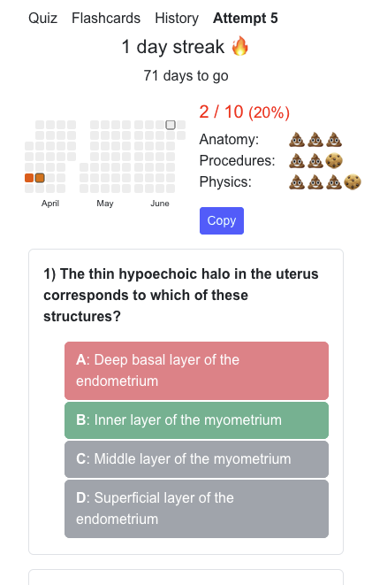

# Smartenator
A static webpage to aid in reviewing for PBR1
## Features
- LocalStorage for persistence. No servers. Completely static.
### Screens
- Quiz Screen
  - Get a random set of questions from a list
  - Form for answering multiple choice questions
- Flashcard Screen
  - Duolingo style
  - One question at a time
  - Immediate Feedback
  - Review your mistakes
  - First attempt is logged as a normal exam
- History Screen
  - Shows chart and table to summarize previous exams
- Attempt Screen
  - Shows results of previous exam

## How to use your own questions
- Given a document that consists of multiple choice questions and indicated answers
1. Ask Deepseek to convert them into the format in [questions.json](./src/questions.json)
  - ChatGPT didn't do so well
2. Replace questions.json with your output
3. If categories changed, change the categories in history.json
